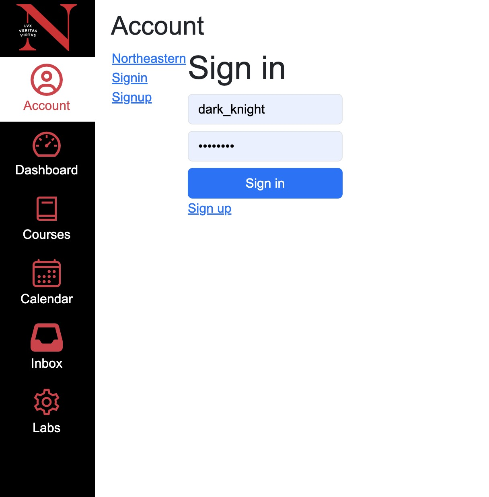
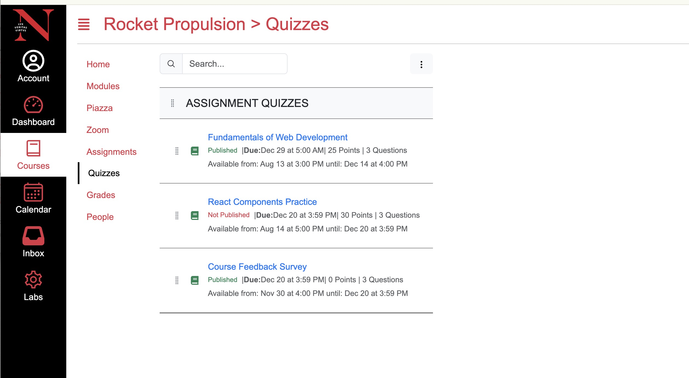

# 🧠 Kanbas LMS Clone

A full-stack clone of Northeastern University's Kanbas learning management system, rebuilt with React, Node.js, Express, and MongoDB.

This project simulates core functionalities of a modern learning platform, including user authentication, quizzes, modules, course management, and user enrollment.




---

## 🚀 Features

- 🔐 Account Sign In / Sign Up
- 🎓 Dashboard with course navigation
- 📚 Modules and content display
- 📝 Quiz management and question listing
- 👥 User enrollment & profile
- 💾 MongoDB for persistent storage
- 🔄 Session handling via express-session
- 🌐 Frontend-backend CORS integration

---

## 🛠 Tech Stack

| Layer    | Technology                |
| -------- | ------------------------- |
| Frontend | React, React Router DOM   |
| Backend  | Node.js, Express.js       |
| Database | MongoDB (local or Atlas)  |
| State    | Redux                     |
| Auth     | express-session + cookies |

---

## 💻 Getting Started

### 1. Clone the repo

```bash
git clone https://github.com/yourusername/kanbas-clone.git
```

### 2. Install and run backend

```bash
cd kanbas-node-server-app
npm install
npm start
```

Backend will run at: `http://localhost:4000`

### 3. Install and run frontend

```bash
cd ../kanbas-react-web-app-fa24
npm install
npm start
```

Frontend will run at: `http://localhost:3000`

---

## 🌍 Live Demo (Optional)

_TODO: Add Netlify + Render deployment links if available._

---

## 📸 Screenshots

### ✅ Sign In Page


### 📋 Quizzes Page


---

## 📁 Project Structure

```
kanbas-clone/
├── kanbas-node-server-app/      # Backend: Express + Mongoose
├── kanbas-react-web-app-fa24/   # Frontend: React + Redux
├── screenshots/                 # Static assets for README
│   ├── signin.png
│   └── quizzes.png
├── README.md
```

---

## 👩‍💻 Author

**Xueming Tang**  
M.S. in Computer Science @ Northeastern University, Silicon Valley  
📍 San Jose, CA

---

## ✨ Future Improvements

- Admin dashboard with course management
- Assignment grading interface
- Real-time messaging with WebSocket
- Deployment to Netlify + MongoDB Atlas

---

## 📬 Contact

- GitHub: [yourusername](https://github.com/yourusername)
- Email: xueming.email@example.com
